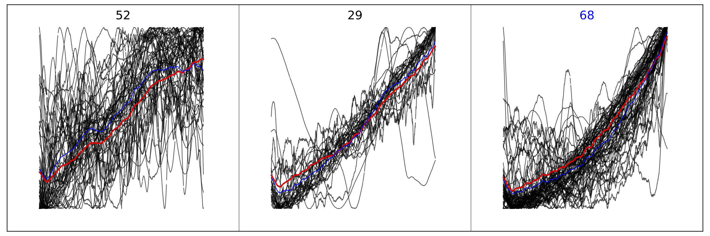
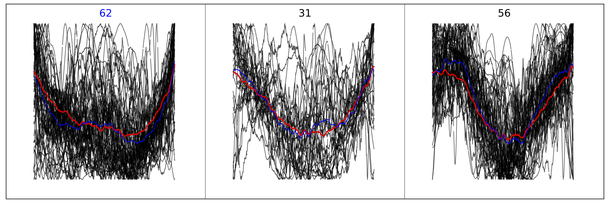
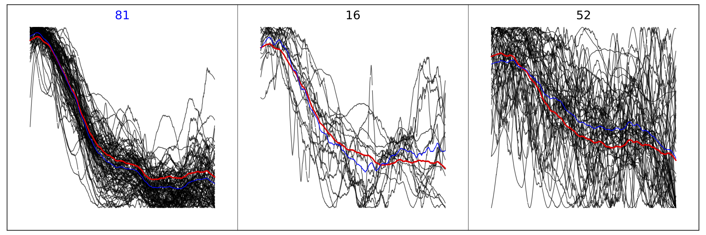
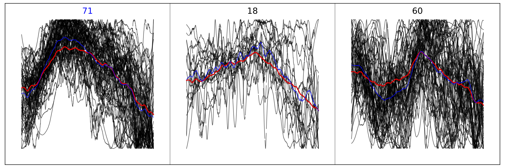
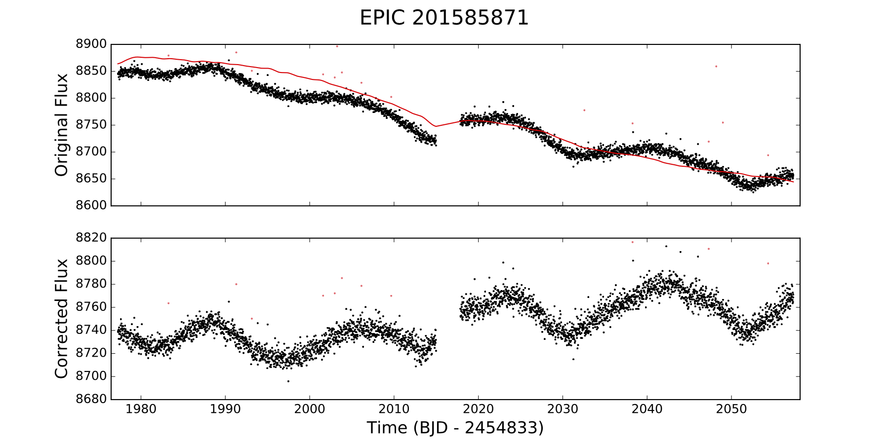
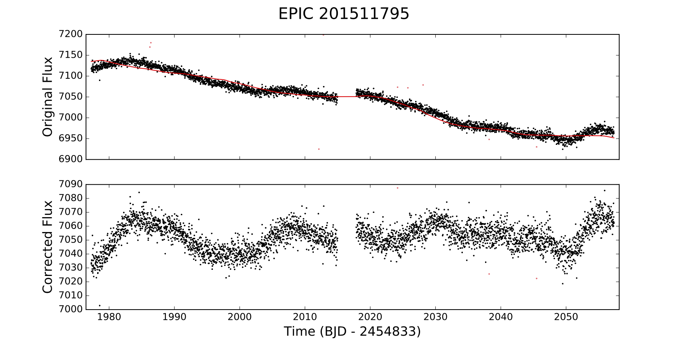
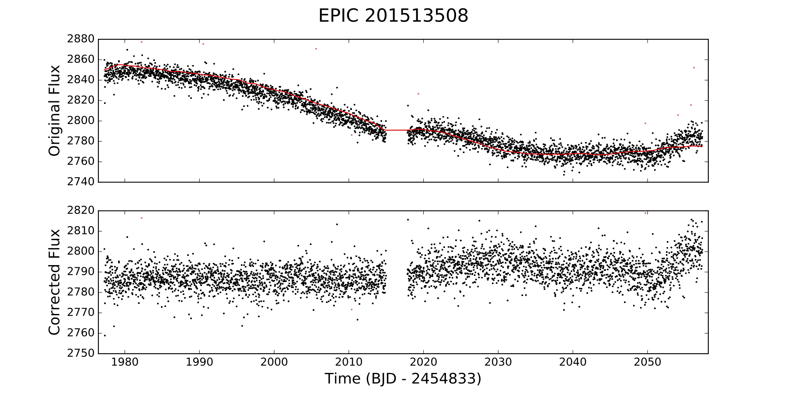
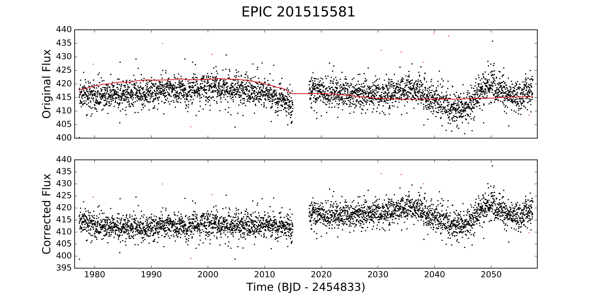
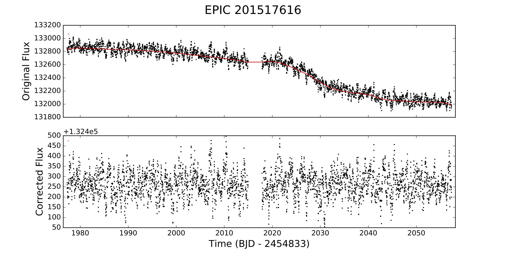
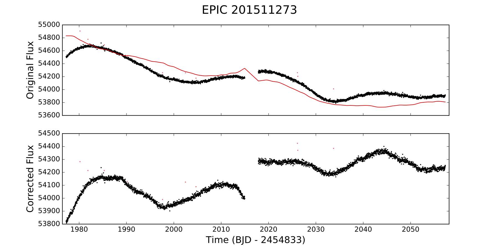

# k2cbv

To run **K2CBV** on the campaign 1 *Everest* light curves in module 18:

```python
import k2cbv

campaign = 1
module = 18
model = 'everest1'
max_stars = 150

# Download the light curves
k2cbv.GetStars(campaign, module, model = model, max_stars = max_stars)

# Construct the design matrix
k2cbv.GetX(campaign, module, model = model, max_stars = max_stars)

# Fit all the stars
k2cbv.FitAll(campaign, module, model = model, max_stars = max_stars)
```

This is what the **3x1** SOMs look like. Normalized light curves are black, the mean light curve in each pixel is blue, and the SOM array in each pixel is red. *Everest* campaign 1 light curves have two segments, so we process them separately (rows). We also compute the SOM twice, the second time after de-trending each of the light curves against the SOM array with the most light curves (blue label).
<table style="width:100%">
  <tr>
  <td></td>
    <th>Iter 01</th>
    <th>Iter 02</th> 
  </tr>
  <tr>
    <th scope="row">Seg 01</th>
    <td></td>
    <td></td> 
  </tr>
  <tr>
    <th scope="row">Seg 02</th>
    <td></td>
    <td></td> 
  </tr>
</table>

And this is what some of the final, de-trended light curves look like:

<table style="width:100%">
  <tr>
    <td></td>
    <td></td> 
  </tr>
  <tr>
    <td></td>
    <td></td> 
  </tr>
  <tr>
    <td></td>
    <td></td> 
  </tr>
</table>

In general it works pretty well. We still need to fine-tune the smoothing -- I'm using a simple Savitsky-Golay low pass filter on the input light curves *and* on the regressors, but there's still some residual higher-frequency noise. Also, in some light curves (such as the last one), the CBVs try to fit out some of the intrinsic stellar variability, which is bad. A good GP model could help, but my GPs wouldn't work for this, since they were trained to fit this signal in the first place.

I find that this works for K2SC, but not as well, mostly because the low frequency systematics are smaller and the CBVs are more dominated by white noise/higher frequency noise (mostly stellar variability I think). A better filtering method might help with this.
